# Phobia Quiz

## Website Screenshots

### Hompage
Here we can see some intro text and a highscore list that displays the users that are saved in local storage. We can see the 3 users that have been saved to localstorage above the input and start quiz button.
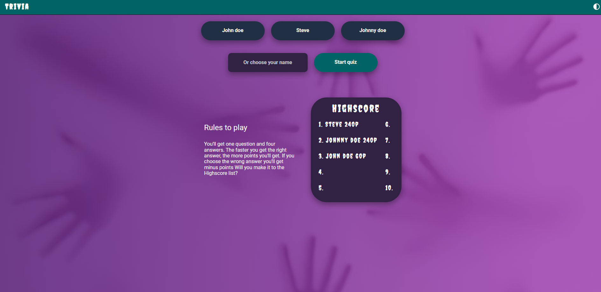

### Quizpage

Here we can se a timer that counts down to 0 and also a question is displayed with 4 diffrent answers. In the green header we an also se the question number along the time elapsed and also a star with a score. This score will be updated according to the answer that the user clicks.
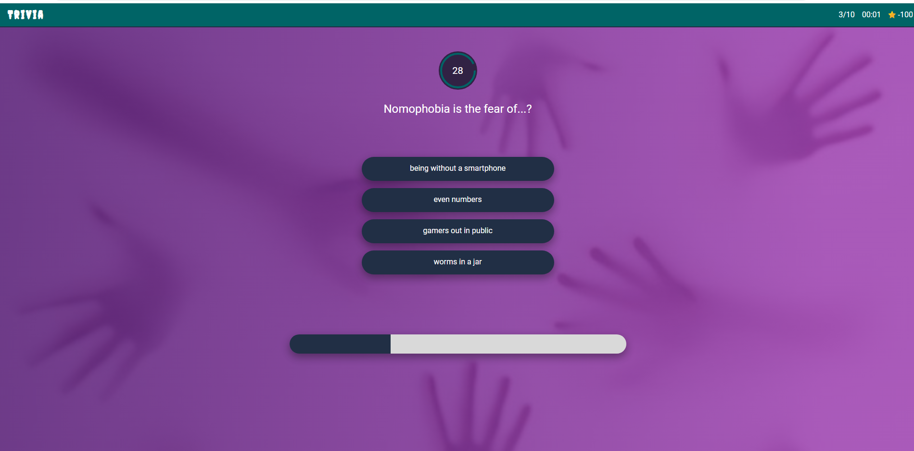

### Finishpage
This is the page the user gets to when the final answer have been clicked, the highscore list is the same one as the homepage and it is displayed from localstorage. The user will get how many questions was correct answered aloong with time and score. The user can restart the quiz again or click the main menu to get back to the homepage.

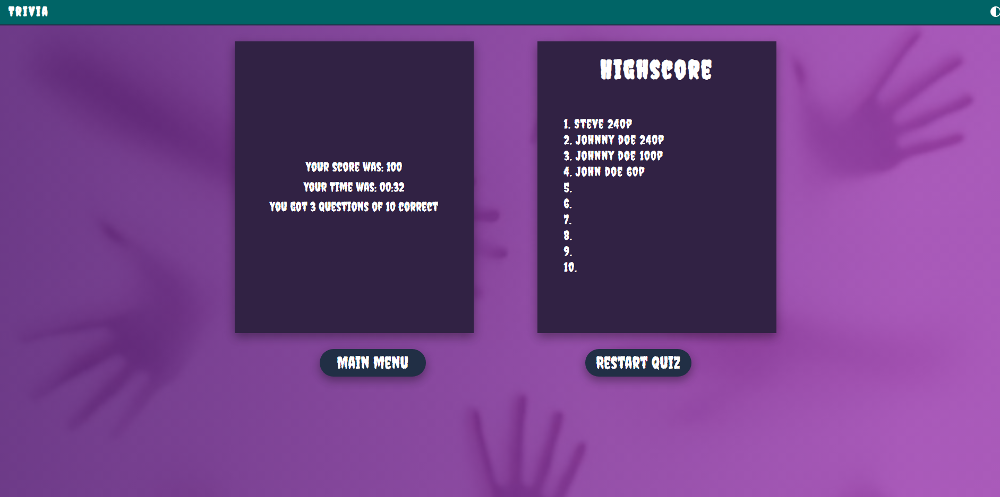

## Wireframe

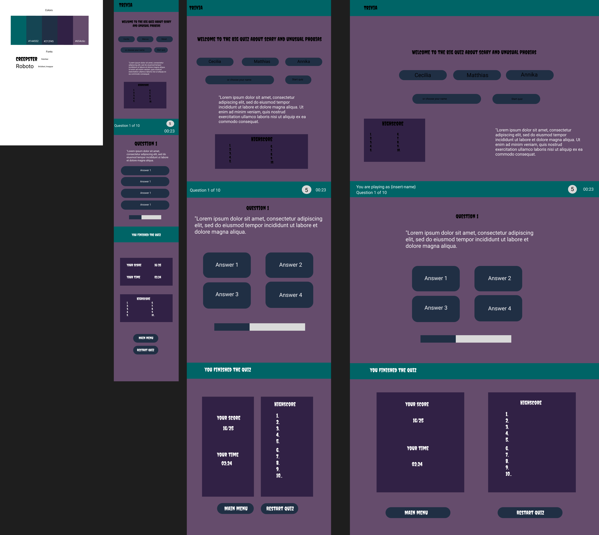

## Tech Stack

- Semantic HTML5 markup
- CSS / Sass
- TypeScript

## Other Technologies

### Local Storage

Local Storage is used to store the users and the highscore list.

### GSAP

For making the animations we used [GSAP (GreenSock Animation Platform)](https://gsap.com/) version 3.12.4

## Code Formatting and Linting

### Prettier

We used Prettier for our code formatting. It helps to format the code and making it consistent throughout the whole project.

### Eslint

For linting we used ESlint. It helped us catch errors in the code and uphold the teams typescript standards. Our Eslint file
follows common rules for this kind of project.

## Live Demo

Explore the live demo of the Phobia Quiz [here](https://medieinstitutet.github.io/fed23d-javascript-grundkurs-gruppuppgift-tangerinerna).

## Status

This project is marked as "In Progress."

## Getting Started

To run the Quiz Game on your local machine, follow these steps:

1. Download or clone the repository.
2. Install the necessary dependencies and node_moduls by running:
* `npm install`

* `npm install gsap`
3. Start the application using `npm run dev` (Vite).

## Description

The Phobia Quiz is an engaging website that will challenge both your speed and knowledge of unusual phobias. It lets you either create
a new user by writing your name or chose from existing users. Next you will have to answer 10 questions and in the end your results will be displayed to you. You will also if you made a high enough score be placed in a prestigious highscore list with other users.

## Gameplay Features

- When the user is selected and you arrive to the question section you can pick from four answers, where one is correct.
- Both the individual question points and the current highscore will be visually updated through animation.
- If the answer is right recieve plus points, if not get minus points.
- When the user picks the right answer they will also get a greater score depending on how fast they picked.

## Validations

- HTML was validated using the [W3C HTML validator](https://validator.w3.org/).
- CSS was validated using the [W3C CSS validator](https://jigsaw.w3.org/css-validator/).
- Lighthouse was used to check Performance, Accessibility, Best Practices and SEO.

### Lighthouse

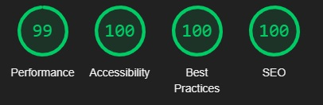

### HTML

### CSS

## Supported screens
The phopbia quiz have been tested on diffrent screens, we have set the breakpoints for tablet screens 768 px. And for desktop screens 1280px.

## Desktop
### Homepage

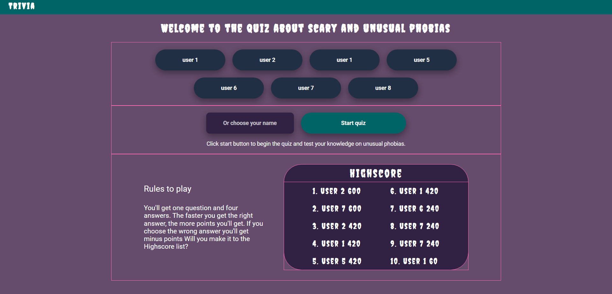

### Quizpage

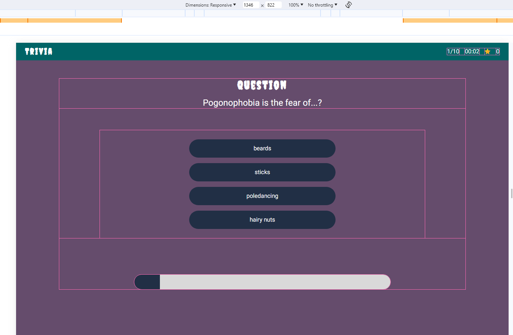

### Finishpage

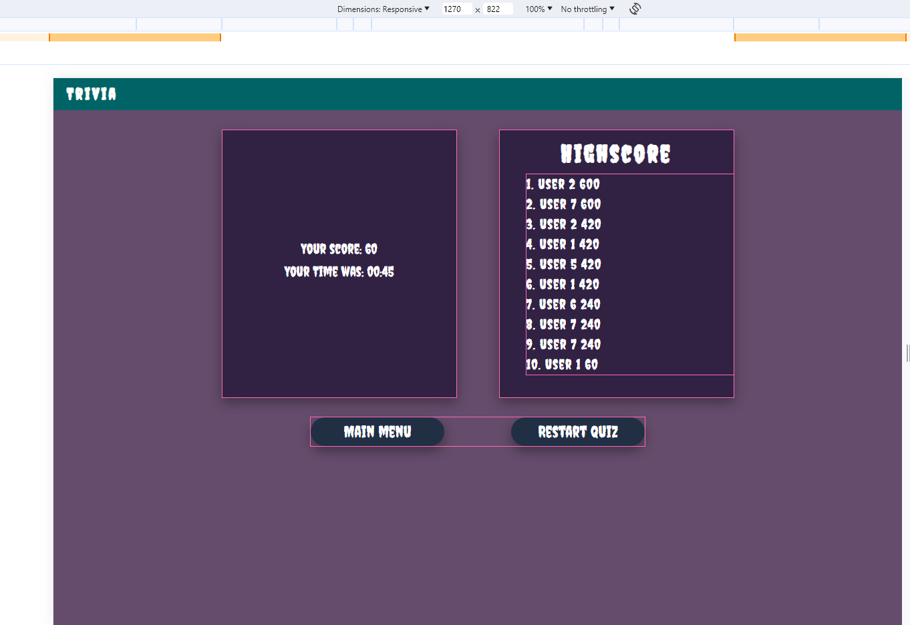

## Mobile and tablet

### Homepage
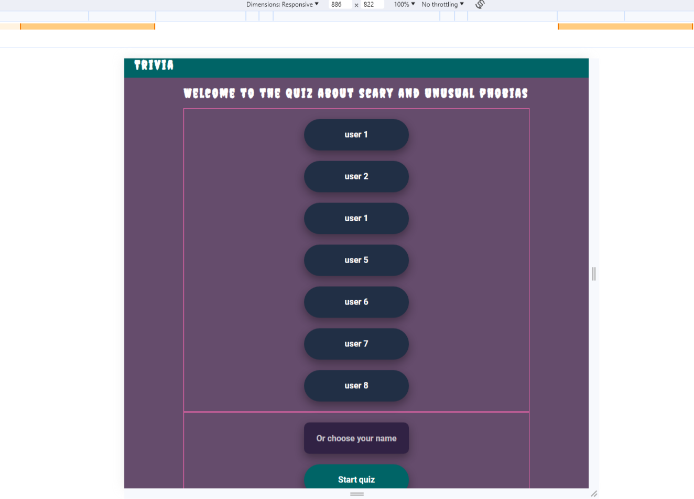

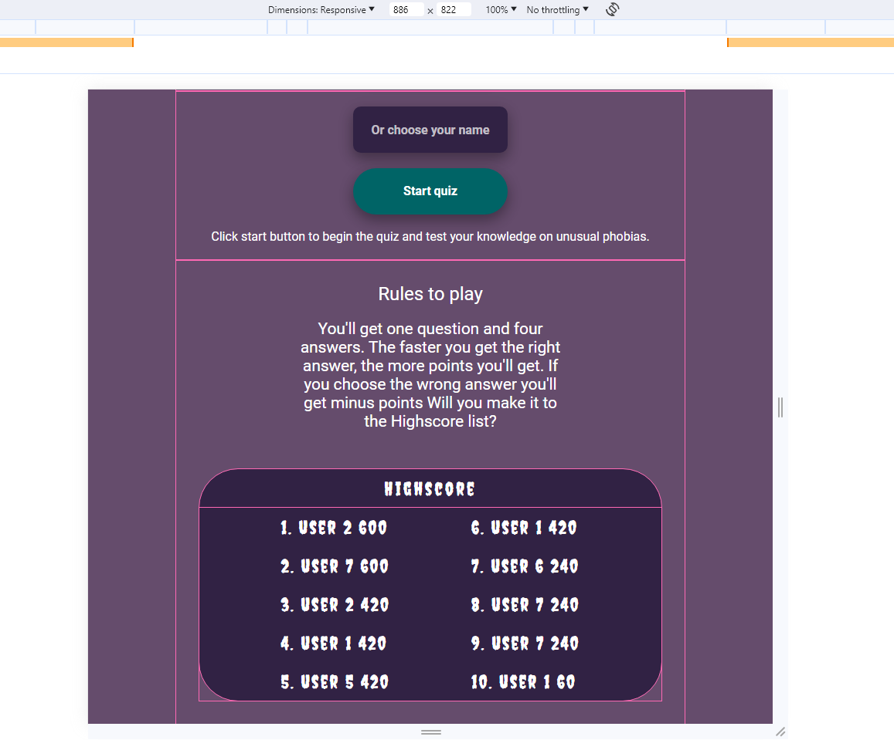

### Quizpage
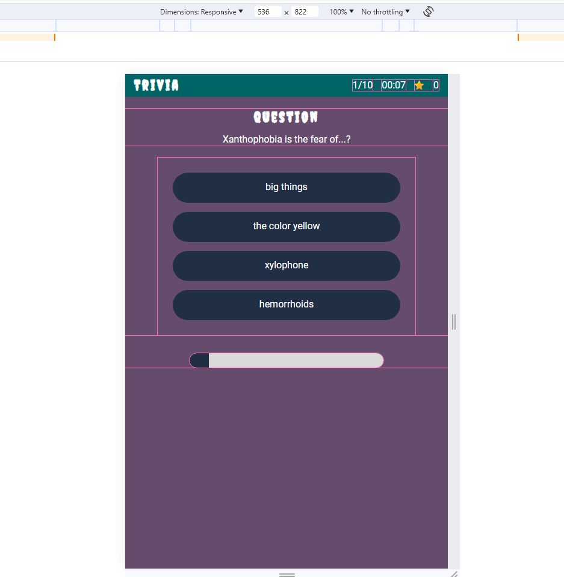

### Finishpage
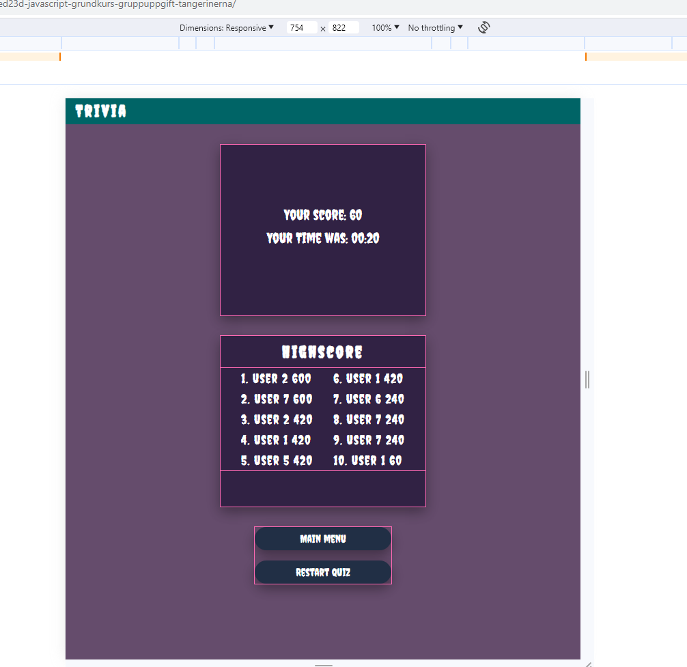

## Participants

- [RalfiSlask](https://github.com/RalfiSlask)
- [CeciliaL1](https://github.com/CeciliaL1)
- [Annika-Nyholm](https://github.com/Annika-Nyholm)
- [rebahama](https://github.com/rebahama)
- [Marcusey](https://github.com/Marcusey)
